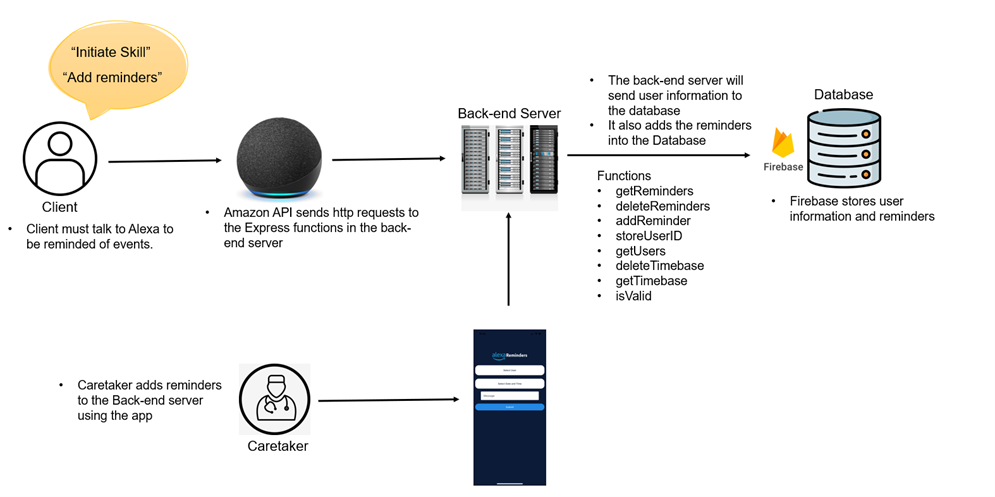

# QL-Caretaker-Alexa-App

## Introduction
For my senior year, we were responsible for integrating several features into an existing application meant to help caretakers interact with their patients using Alexa Reminders, for QL+

I was responsible for integrating the Alexa skill into the application, which would allow caretakers to set reminders for their patients, and have them play on their Alexa devices.

Here I have uploaded the existing code for the interface I designed to respond to the Alexa skill, as well as the code for the Alexa skill itself.

## Table of Contents
- [Features](#features)
- [Usage](#usage)
- [Technologies Used](#technologies-used)
- [Design](#design)
- [Setup and Installation](#setup-and-installation)
- [Acknowledgements](#acknowledgements)

## Features
- **Client Selection**: Clients are able to be selected from the database in the caretakers application
- **Alexa Reminders**: Reminders are able to be added in bulk to the database, and the patient will be able to hear them on their Alexa device
- **Persistant Reminders**: Reminders repeat 3 times after the inital reminder, and if the patient doesn't acknowledge the reminder after the backups, the caretaker will be notified
- **Firebase Application**: Extensive firebase database application to store all the reminders and client information
- **Alexa Skill Creation**: Fully interactive Alexa skill custom built for QL+ which interacts with the firebase database

## Usage
In order to allow your caretaker to have access to your Alexa reminders. All you would have to do is:
1. Have an Alexa device
2. Have an Amazon account
3. Download the skill from the Alexa Skills store
4. Allow for user permissions in the skills settings

Once you have the skill downloaded, all you have to say is:

> Alexa, Initialize Skill

This will send you information to the database where the caretaker will now have your name, email, phone number, and Alexa ID.

Now, the caretaker will see your name pop up in their reminders app, to where they will add as any reminders as they want to your account.

**This can range from taking pills, to calling your doctor, etc.**

Once they have added all the reminders, they will tell you to say:

> Alexa, Add Reminders

This will add all of the reminders to your account as well as 3 backup remindres for each reminder

Once you have completed the task at hand, let your Alexa know by saying:

> Alexa, I *insert action here*

After completing this, the extra reminders will be removed and you can go about your day. If you dont acknowledge the reminders in the 8 minutes during the backup reminders are valid, the caretaker is notified

## Technologies Used
- Firebase firestore
- Alexa Skills Kit
- Express.js Firebase functions
- React
- Amazon Web Services
- Expo CLI

## Design

**The Design of the application was split into three parts, the Alexa Skill, the Firebase Application, and the Caretaker interface.**

Firstly, I began developing the Alexa skill and understanding ASK and AWS a little bit more. Creating the skill and getting it to run on the test alexa we had was the easy part. Things got difficult when it came to adding reminders to the Alexa device. Unfortunately, you can only add reminders to the Alexa device through an alexa skill if and only if you are calling the reminders API with an in-session access token. Meaning that you cannot add reminders unless the user is directly interacting with the Alexa. This is so that people with bad intentions cannot go and add thousands of reminders to an unkowning users Alexa skill, however for us, it means that the user must be more involved in the reminder-adding process, which is a big negative for us. Thankfully, once you have an in-session token, there is no limit to the amount of Reminders that you can add on behalf of a user. Following this, we then created the Firebase application.

This application stored information about the user, and the reminders that the caretaker would add on behalf of them. The idea with this is that the caretaker would be able to add reminders for an extended period of time, for example up to a month out. This can be acheieved in the applications interface.  Once they add the reminders to the account, they can then prompt the patient to ask the Alexa skill to "Add Reminders". This will then add all the reminders that the caretaker added to the database to the patients Alexa device. On top of that, it will also add 3 backup remindres, set to go off 5 minutes, 7 minutes, and 8 minutes after the first reminder, as well as set an 8 minute time in the background on the firebase server. If the patient does not say "Action complete" or "I took my pills", etc., then the server will send a notification to the caretaker that the patient did not respond to the reminder, and that they should check in on them.

## Setup and Installation
The code provided is not able to run on its own without initializing your own Alexa Skill and establishing your own paid firebase application. However, the [Setup and Installation instructions will be provided here](resources/Setup.pdf) for those who wish to do so, or need assisting understanding ASK Reminders.

The firebase functions are stored in the firebase-final folder under functions/index.js. The Alexa Skills Index is stored under the LWAFinished folder, under alexaSkillIndex.js. The React application is stored under the LWAFinished folder, under src/App.js.

## Acknowledgements
I'd like to thank Kenneth and Yafet for designing the remainder of the application and making my integration so easy. I'd also like to thank my team for being so supportive and helpful throughout the entire process. I'd also like to thank QL+ for giving me the opportunity to work on this project and learn so much about Alexa Skills and Firebase.

---

Leave a ⭐️ if you like this project!
